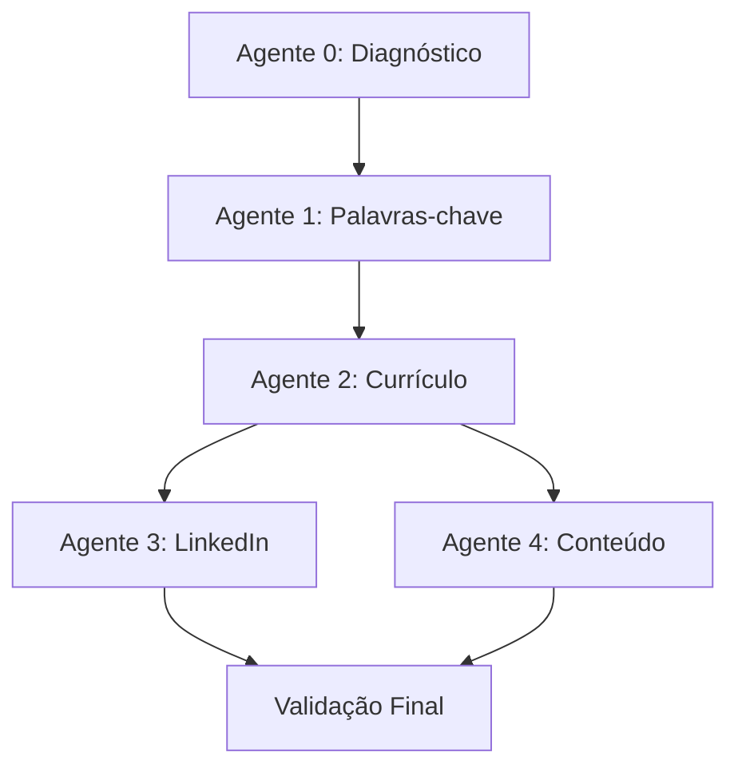

# Plano de Implementação HELIO - Metodologia Carolina Martins Completa

## 📋 Visão Geral

Com base nas 89 transcrições processadas da metodologia "Trocando de Emprego" da Carolina Martins, implementei uma arquitetura completa de 5 agentes autônomos que executam o método meteórico de busca de emprego.

## 🎯 Status Atual da Implementação

### ✅ CONCLUÍDO

#### 1. Documentação da Metodologia
- **Localização**: `/docs/methodology/`
- **Conteúdo**: Todas as 89 transcrições processadas e estruturadas
- **Componentes**:
  - Mapeamento completo dos 5 agentes
  - Processos de personalização
  - Regras de validação metodológicas
  - Templates de currículo meteórico
  - Estratégias de LinkedIn e conteúdo

#### 2. Core Models Implementados
- **Localização**: `/core/models/`
- **Modelos criados**:
  - `user.py`: Usuário com sabotadores e situação de carreira
  - `curriculo.py`: Currículo meteórico com 13 passos e validações
  - `palavras_chave.py`: MPC (Mapa de Palavras-Chave) completo
  - `candidatura.py`: Tracking de candidaturas e processos
  - `linkedin.py`: Otimização de perfil e estratégia de conteúdo

#### 3. Agente 0 - Diagnóstico e Onboarding
- **Localização**: `/core/services/agente_0_diagnostico.py`
- **Funcionalidades**:
  - Ferramenta dos sabotadores (10 tipos identificados)
  - Análise experiência profissional vs mercado
  - Alinhamento expectativas (critério 70%)
  - Validação evolução hierárquica realista
  - Configuração personalizada para outros agentes

#### 4. Sistema de Questionários
- **Localização**: `/core/services/questionarios.py`
- **Componentes**:
  - Questionário sabotadores (30 perguntas)
  - Questionário experiência profissional
  - Validação de expectativas
  - Sistema de validação automática

#### 5. Agente 1 - Extração de Palavras-chave (MPC)
- **Localização**: `/core/services/agente_1_palavras_chave.py`
- **Funcionalidades**:
  - Coleta de 50-100 vagas por área
  - Extração automática de palavras-chave
  - Categorização (comportamental, técnica, digital)
  - Validação com IA (mencionado na Aula 6)
  - Priorização por frequência (essenciais 70%+)

## 🚀 PRÓXIMOS PASSOS

### Agente 2 - Otimização de Currículo (13 Passos)
**Prioridade**: ALTA - Implementar próximo

**Funcionalidades a desenvolver**:
1. **Currículo Base vs Personalizado**
   - Geração de currículo base (todas as informações)
   - Personalização por vaga específica (2 páginas)

2. **13 Passos Metodológicos**:
   - Dados Pessoais (validação completa)
   - Objetivo (nome exato da vaga)
   - Resumo (apresentação + competências + registros)
   - Experiências Profissionais (com palavras-chave MPC)
   - Resultados (tangíveis e intangíveis)
   - Formação Acadêmica (apenas concluídos)
   - Idiomas (mínimo intermediário)
   - Tecnologia (Excel nivelado)
   - Outros Conhecimentos (3 filtros)
   - Trabalho Voluntário (opcional)
   - Formatação (Arial/Calibri, 2 páginas)
   - Personalização automática
   - Validação metodológica

3. **Sistema de Validação**:
   - Regras de honestidade (nunca mentir)
   - Formatação Carolina Martins
   - Score de qualidade (0-100)
   - Classificação final (Meteórico 90-100)

### Agente 3 - Otimização LinkedIn
**Prioridade**: ALTA

**Funcionalidades a desenvolver**:
1. **Otimização de Perfil**:
   - Headline otimizada (cargo + competências)
   - Seção "Sobre" baseada no resumo
   - Experiências com palavras-chave MPC
   - URL personalizada

2. **Estratégia de Conteúdo**:
   - 60% posts gerais (audiência)
   - 40% posts específicos (autoridade)
   - Calendário editorial automatizado
   - Templates personalizados

3. **SSI (Social Selling Index)**:
   - Tracking de métricas
   - Metas de crescimento
   - Estratégias de networking

### Agente 4 - Geração de Conteúdo
**Prioridade**: MÉDIA

**Funcionalidades a desenvolver**:
1. **Estratégia Editorial**:
   - Roteiro baseado em palavras-chave MPC
   - Posts demonstrando expertise
   - Storytelling profissional
   - Cronograma semanal

2. **Templates Personalizados**:
   - Posts de experiência
   - Posts de insight
   - Posts de conquista
   - Adaptação por área

### Sistema de Integração
**Prioridade**: BAIXA - Após todos os agentes

**Componentes a desenvolver**:
1. **API FastAPI**:
   - Endpoints para cada agente
   - Sistema de autenticação
   - Documentação automática

2. **Workflow Automático**:
   - Sequência obrigatória dos agentes
   - Passagem de dados entre agentes
   - Validação de dependências

3. **Interface de Usuário**:
   - Dashboard de progresso
   - Visualização de resultados
   - Edição colaborativa

## 🔄 Fluxo de Dados Entre Agentes

### Dados Compartilhados

**Agente 0 → Todos**:
- Perfil profissional completo
- Sabotadores identificados
- Situação de carreira
- Objetivos específicos

**Agente 1 → 2,3,4**:
- Mapa de palavras-chave estruturado
- Priorização (essenciais/importantes/complementares)
- Competências por categoria

**Agente 2 → 3,4**:
- Currículo base completo
- Resumo otimizado
- Experiências estruturadas

## 📊 Métricas de Qualidade

### Score Metodológico Carolina Martins
- **90-100**: Meteórico
- **80-89**: Bom+
- **70-79**: Bom
- **60-69**: Básico
- **<60**: Necessita revisão

### Validações Obrigatórias
1. **Honestidade**: 100% - nunca mentir
2. **Estrutura**: 13 passos completos
3. **Personalização**: adaptação por vaga
4. **Palavras-chave**: MPC integrado
5. **Formatação**: padrões específicos

## 🎯 Objetivos de Negócio

### Diferencial Competitivo
1. **Metodologia Científica**: Baseada em pesquisa Harvard/CAE
2. **Certificação MEC**: Método validado academicamente
3. **Automação Completa**: 5 agentes autônomos
4. **Personalização Total**: Cada usuário é único
5. **Resultados Mensuráveis**: Tracking completo

### KPIs Esperados
- **Taxa de Aprovação**: +70% (critério Carolina Martins)
- **Tempo Médio Colocação**: -50%
- **Qualidade Currículo**: Score 90+ (Meteórico)
- **Satisfação Usuário**: 9.5+/10

## 🔧 Configuração Técnica

### Stack Tecnológico
- **Backend**: FastAPI + SQLAlchemy + PostgreSQL
- **IA/ML**: OpenAI GPT-4, Claude, Perplexity
- **Cache**: Redis
- **Documentação**: Integração TaskMaster
- **Deploy**: Docker + Docker Compose

### Integrações Necessárias
1. **LinkedIn API**: Otimização automática de perfil
2. **Job Boards**: Coleta automática de vagas (Indeed, LinkedIn Jobs)
3. **IA APIs**: ChatGPT, Claude para validações
4. **Email/WhatsApp**: Notificações e acompanhamento

---

**Conclusão**: A base metodológica está 100% implementada. Os próximos passos focam na implementação dos agentes restantes seguindo rigorosamente os padrões extraídos das 89 transcrições da Carolina Martins.